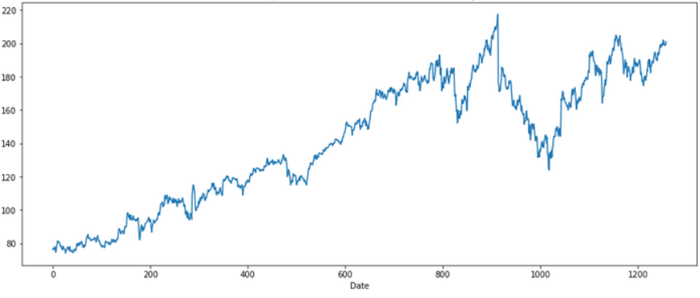
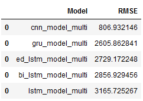

# Univariate-Time-Series-Forecasting




Most of the time we deal with cross-sectional data. Here, the data is collected at a specific point in time. On the other hand, time series data is a collection of observations obtained through repeated measurements over time. 


## Table of Contents
1. [Introduction](#introduction)
2. [Software Requirements](#software_requirements)
3. [Folder Structure](#folder_structure)
4. [Getting Started](#getting_started)
5. [Overview of the Results](#overview)
6. [Link to the Publication](#link_publication)    
7. [Authors](#authors)
8. [Motivation](#motivation)
9. [References](#ref)


<a name="introduction"></a>

## Introduction

In this repository I have deposited a Jupyter notebook which contains various neruonal networks for time series predictions. 
With this script you can quickly and easily check which type of neural network fits best to the data.

<a name="software_requirements"></a>

## Software Requirements

Required libraries:

+ Python 3.x
+ Numpy
+ Pandas
+ Matplotlib
+ Scikit-Learn
+ Tensorflow


Please run ```pip install -r requirements.txt```


<a name="folder_structure"></a>

## Folder Structure

```
C:.
│   Metro_Interstate_Traffic_Volume.csv
│   Time-Series-Forecasting-with-Keras.ipynb
│
└───model
        bi_lstm_model_multi.h5
        cnn_model_multi.h5
        ed_lstm_model_multi.h5
        gru_model_multi.h5
        lstm_model_multi.h5
```

Besides the Jupyter notebook and the dataframe I created a model file.
The created models are automatically saved in this directory when the script is executed.


<a name="getting_started"></a>

## Getting Started

1. Make sure Python 3 is installed.
2. Clone the repository and navigate to the respective project's root directory in the terminal
3. Use a command line of your choice and navigate to the respective project's root directory. Run the following commands:
    1. ```cd "path/to/root directory"```
    2. ```jupyter notebook"```
4. In the browser window that opens, select the Jupyter Notebook file.
5. Select the parameters of the neural network as desired.
6. Select *Cell* in the menu shown above and execute *Run All*.


<a name="overview"></a>

## Overview of the Results

I used five different Neural Networks:

+ LSTM
+ Bidirectional LSTM
+ GRU
+ Encoder Decoder LSTM
+ CNN

Here is an overview of the results:



The CNN model with a RMSE (root-mean-square error) of 806 is many times better than the LSTM model with a RMSE value of 3165 which is the worst of all.
 

<a name="link_publication"></a>

## Link to the Publication

Here is the link to my blog post: [Time Series Analysis - Neural Networks with multiple predictors](https://michael-fuchs-python.netlify.app/2020/11/04/time-series-analysis-neural-networks-with-multiple-predictors/). In it I explained the exact difference of the methods used and described my procedure in detail.

If this repository/publication helped you, you are welcome to read other blog posts I wrote on the topic of time series analysis: 

+ [XGBoost for Univariate Time Series](https://michael-fuchs-python.netlify.app/2020/11/10/time-series-analysis-xgboost-for-univariate-time-series/)
+ [Neural Networks for Univariate Time Series](https://michael-fuchs-python.netlify.app/2020/11/01/time-series-analysis-neural-networks-for-forecasting-univariate-variables/)
+ [Regression Extension Techniques for Univariate Time Series](https://michael-fuchs-python.netlify.app/2020/10/29/time-series-analysis-regression-extension-techniques-for-forecasting-multivariate-variables/)
+ [Regression Extension Techniques for Multivariate Time Series](https://michael-fuchs-python.netlify.app/2020/10/27/time-series-analysis-regression-extension-techniques-for-forecasting-univariate-variables/)
+ [Smoothing Methods](https://michael-fuchs-python.netlify.app/2020/10/23/time-series-analysis-smoothing-methods/)
+ [Working with Dates and Times](https://michael-fuchs-python.netlify.app/2020/10/19/time-series-analysis-working-with-dates-and-times/)


<a name="authors"></a>

## Authors

+ [Michael Fuchs](https://github.com/MFuchs1989)

<a name="motivation"></a>

## Motivation: 

I've been blogging since 2018 on my homepages about all sorts of topics related to Machine Learning, Data Analytics, Data Science and much more.
You are welcome to visit them:

+ [Python Blog](https://michael-fuchs-python.netlify.app/)
+ [R Blog](https://michael-fuchs.netlify.app/)

I also publish individual interesting sections from my publications in separate repositories to make their access even easier. 


<a name="ref"></a>

## References: 

Vishwas, B. V., & Patel, A. (2020). Hands-on Time Series Analysis with Python. New York: Apress. DOI: 10.1007/978-1-4842-5992-4


